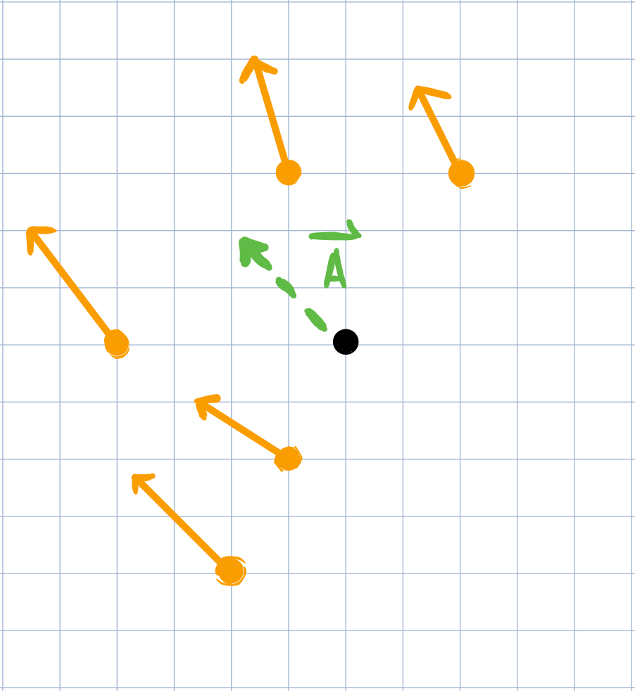
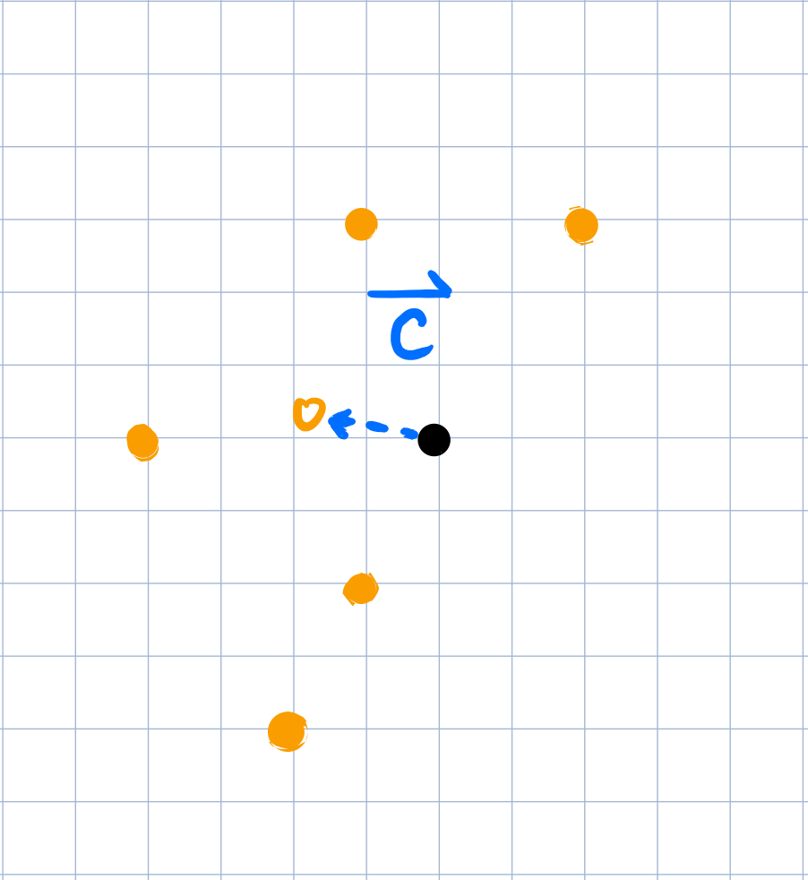
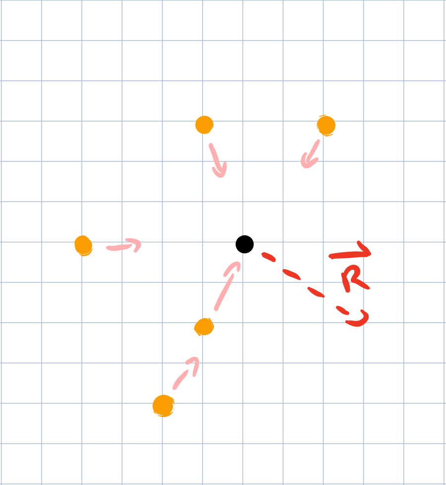

# Flocking Simulator

This coding project was inspired by <a href="https://youtu.be/mhjuuHl6qHM">this video
</a> by the Youtube channel Coding Train.

This project is a demonstration of emergent behavior, where a handful of simple 
rules can result in macroscopic behavior.

In this simulation, there are three forces that act on each boid based on the
properties of the boids that are nearby: alignment, cohesion, and repulsion. For 
any given boid, we'll call the set of all boids within a given radius its "flock."

## 1. Alignment

Under alignment, each boid wants to fly in the same direction as its local flock.
To achieve this, the program applies a force on the boid in the direction of the
average velocity of the local flock. The following is an illustration of an
aligning force being applied on a boid.

## 2. Cohesion

Under cohesion, each boid wants to be a part of the flock, and so will want to
fly towards other boids. This is done by applying a force towards the "center
of mass" of the local flock. Here is an illustration of cohesion being applied 
on a boid.

## 3. Repulsion

Under repulsion, each boid wants to avoid colliding with other boids, and feels 
a force pushing them away from nearby boids. This force gets much stronger as the 
boids get closer together. This is achieved by calculating pair-wise repulsive
forces that act under the inverse square law, analogous to coulomb's law and like-
charges. These forces are then added, scaled, and applied to the respective boid.

## Additional Details of Implementation

The speed of each boid is fixed. So they can never slow down or speed up too much. 
Additionally, the contribution of each of the three forces above are scaled by 
a constant, stored as `A_FACTOR`, `C_FACTOR`, and `R_FACTOR`.

Boids also wrap around the screen whenever they reach the edges of the screen. 

## Future Work

Something I should change about this implementation is to compute all of the 
forces acting on all the boids before applying the forces and updating the 
positions of each boid. Otherwise, boids would have different positions and 
velocities that bleed into later calculations in the same game tick. Although
the contribution of this error is not terribly  significant, it is not a 
completely accurate simulation for this reason. 

Additionally, because the boids wrap around the screen, boids on the edge of 
the screen should theoretically be affected by the boids near the opposite 
edge of the screen. The way I do my calculations however does not handle this 
case, and considers boids near opposite edges of the screen as not part of 
either's local flock.

(This project was developed on a flight to 2019's ICMCP conference from Logan 
airport.)
